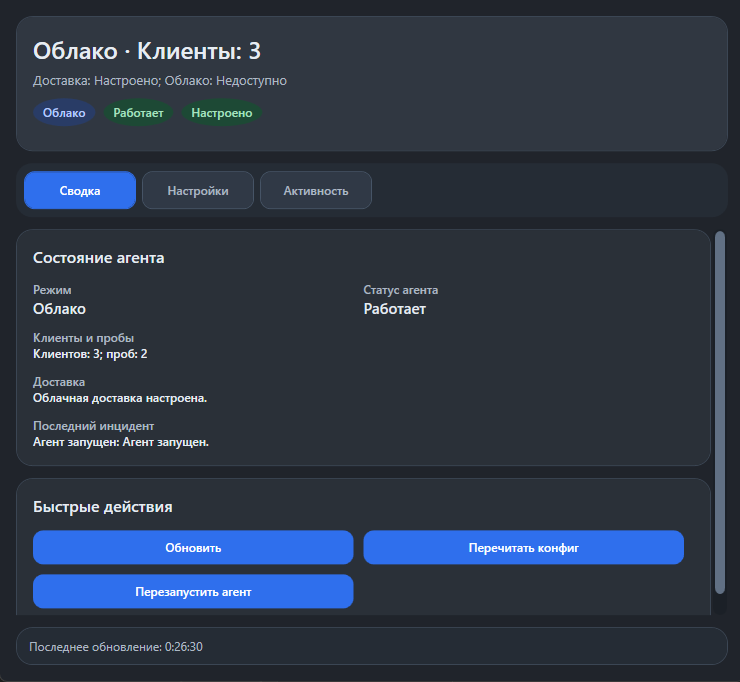
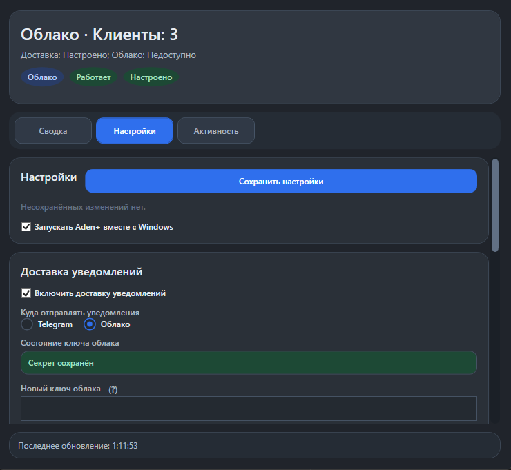
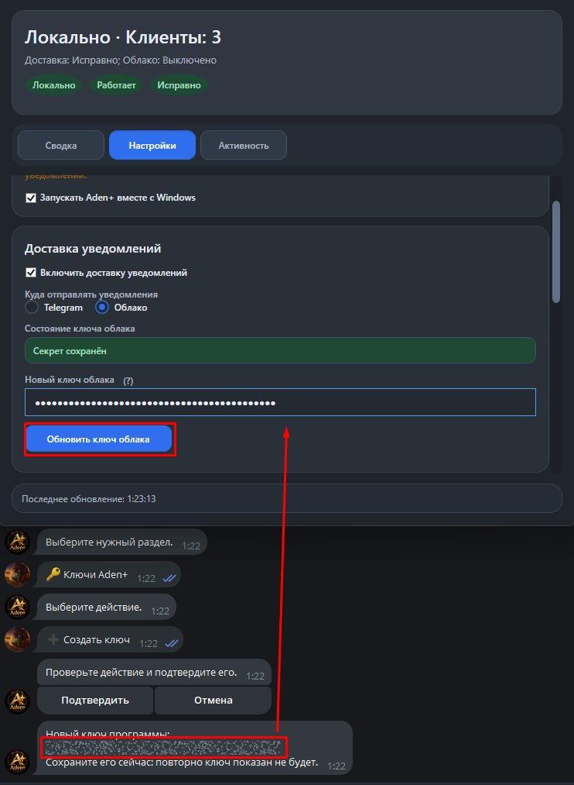
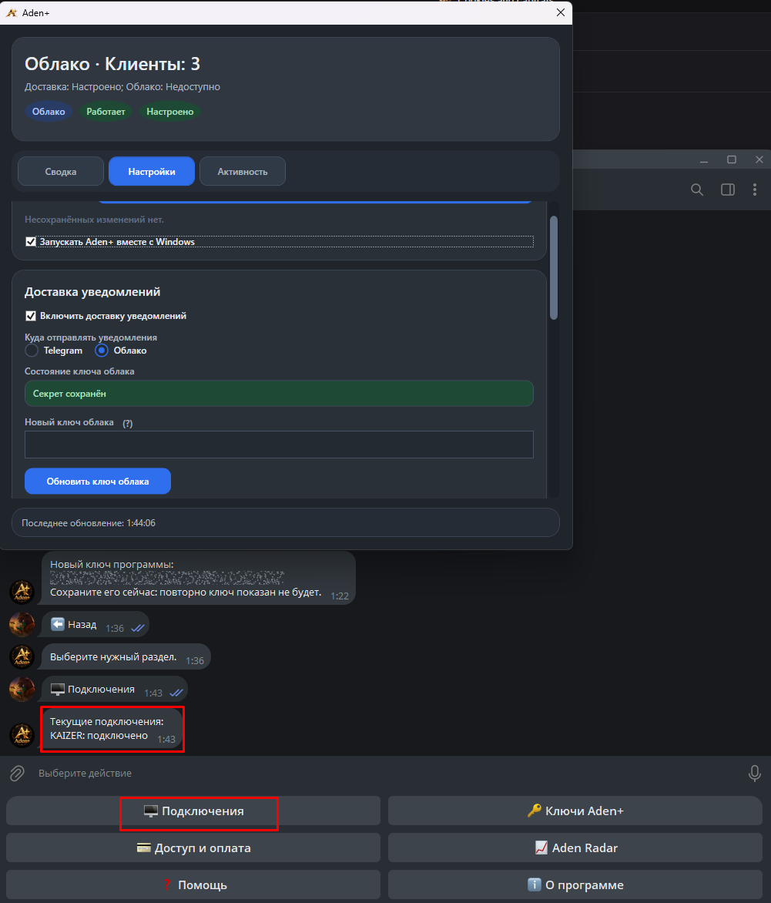
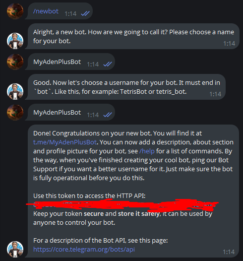
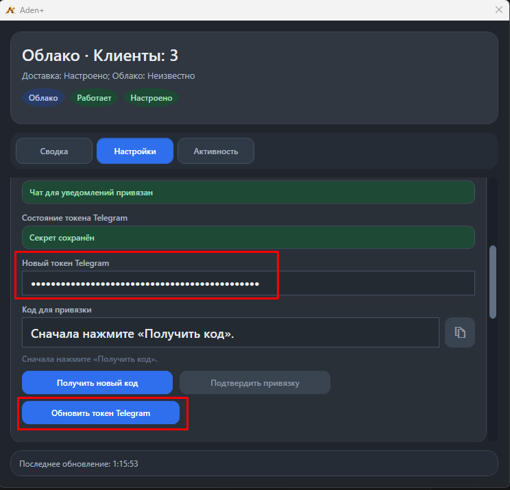
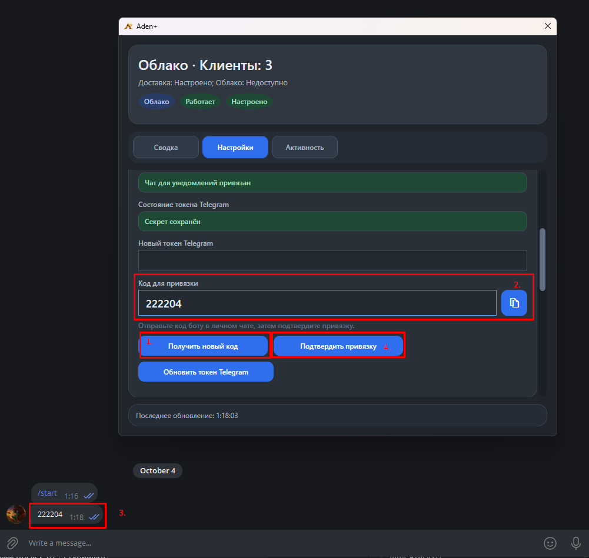
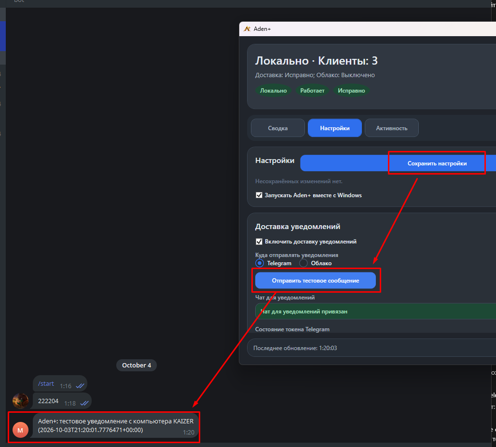

# Aden+

[](https://github.com/hellsmenser/l2monitor/actions/workflows/ci.yml)
[](LICENSE)

Aden+ — приложение для Windows, которое следит за состоянием запущенных клиентов Lineage II и отправляет уведомления, когда клиент теряет игровое соединение, закрывается или когда по косвенным признакам обнаружено событие смерти персонажа.

Приложение работает рядом с игрой и не вмешивается в её процесс. У Aden+ одна пользовательская точка входа — `Aden+.exe`. Внутренний фоновый компонент запускается автоматически.

Связанный Telegram-бот: [@AdenPulse_bot](https://t.me/AdenPulse_bot).

> [!IMPORTANT]
> Aden+ не связан с разработчиком или издателем Lineage II и не является официальным приложением игры. Все сведения получаются из косвенных источников операционной системы: состояния процессов, таблиц сетевых соединений Windows и системного аудиопотока. Aden+ не внедряется в процесс игры, не читает и не изменяет память клиента, не перехватывает, не расшифровывает и не модифицирует сетевой трафик игры. Исходный код открыт, чтобы эти границы можно было независимо проверить.

## Приватность и безопасность аккаунта

Aden+ не запрашивает и не хранит логин, пароль, коды двухфакторной аутентификации или другие данные аккаунта Lineage II. Приложение не получает доступ к игровым файлам, содержимому памяти клиента, игровому чату, вводу с клавиатуры или содержимому сетевого трафика. Поэтому у Aden+ нет данных, с помощью которых можно войти в игровой аккаунт.

На компьютере пользователя хранятся только технические настройки приложения: тексты уведомлений, фильтры, привязка чата, ключ сервиса или токен собственного Telegram-бота, текущее диагностическое состояние и журналы работы. Секреты защищаются средствами Windows DPAPI для текущего пользователя.

- в автономном режиме готовый текст уведомления отправляется с компьютера напрямую в Telegram через выбранного пользователем бота;
- в режиме сервиса Aden+ приложение передаёт серверам Aden+ ключ авторизации, имя устройства, версию приложения, служебные сигналы доступности и готовый текст включённых пользователем уведомлений. Данные игрового аккаунта не передаются;
- независимо от режима доставки официальная сборка делает неавторизованный запрос версии к сервису Aden+. Запрос не содержит ключи, настройки или события мониторинга.

Если вы хотите проверить это независимо, передайте ссылку на открытый репозиторий любой нейросети на ваш выбор или специалисту по безопасности и попросите провести аудит исходного кода: проверить сетевые запросы, локальное хранение секретов и используемые источники данных. Автоматический анализ не заменяет профессиональный аудит, но позволяет быстро убедиться, что приложение не обращается к данным игрового аккаунта.

## Что умеет Aden+

- показывает обнаруженные клиенты Lineage II и их текущее состояние;
- уведомляет о потере игрового соединения и закрытии клиента;
- может распознавать настроенные звуковые признаки смерти персонажа;
- отправляет уведомления через сервис Aden+ или напрямую через личного Telegram-бота;
- позволяет исключать служебные окна по части заголовка;
- хранит секреты локально в зашифрованном для текущего пользователя Windows виде;
- по желанию запускается вместе с Windows.



## Установка

### 1. Скачать и распаковать

Скачайте архив `AdenPlus-v...-win-x64.zip` из раздела Releases и полностью распакуйте его в постоянную папку. Не запускайте программу прямо из окна архиватора. Перед использованием ознакомьтесь с [политикой конфиденциальности](PRIVACY.md) и [политикой подписи](CODE_SIGNING.md).

<!-- TODO release: добавить docs/media/release_download.png -->
> **Скриншот:** нужные файлы на странице GitHub Release и проверка SHA-256. *(Будет добавлен.)*

### 2. Запустить Aden+

Откройте `Aden+.exe` — это единственный файл, который нужно запускать вручную. Для подписанного релиза проверьте издателя `SignPath Foundation`. Если Windows SmartScreen показывает предупреждение для неподписанной предварительной сборки, продолжайте только после проверки SHA-256 архива и источника загрузки.

<!-- TODO release: добавить docs/media/first_launch.png -->
> **Скриншот:** первый запуск и предупреждение Windows SmartScreen. *(Будет добавлен.)*

### 3. При необходимости включить автозапуск

Откройте «Настройки» и отметьте «Запускать Aden+ вместе с Windows».



Закрытие окна сворачивает Aden+ в область уведомлений. Команда «Выйти из Aden+» в меню значка завершает и интерфейс, и фоновый компонент.

Aden+ независимо от выбранного режима доставки проверяет версию через публичный endpoint
сервиса `/public/client-version`. Если установлена устаревшая версия, Windows показывает системное уведомление
не чаще одного раза в 24 часа, а в окне остаётся заметная панель «Скачать обновление».
Кнопка открывает опубликованную сервисом официальную страницу релиза в браузере; приложение не скачивает и не запускает
исполняемые файлы автоматически. Перед заменой версии по-прежнему проверяйте SHA-256.

<!-- TODO release: заменить текст ссылкой на опубликованное видео -->
**Видеоинструкция по установке и настройке:** будет добавлена перед публичным анонсом.

## Настройка через @AdenPulse_bot

Это рекомендуемый вариант: внешний сервис видит, что Aden+ перестал выходить на связь, поэтому может сообщить даже о полном обрыве интернета, зависании Windows или выключении компьютера.

### 1. Получить ключ в боте

1. Откройте [@AdenPulse_bot](https://t.me/AdenPulse_bot) и нажмите `/start`.
2. Откройте раздел «Доступ и оплата» и убедитесь, что доступ Aden+ активен.
3. Откройте «Ключи Aden+», создайте новый ключ и сразу сохраните его: бот показывает полный ключ только один раз.

### 2. Подключить приложение

1. В Aden+ откройте «Настройки», включите доставку и выберите «Облако».
2. Вставьте ключ в поле «Новый ключ облака» и нажмите «Обновить ключ облака».
3. Нажмите «Сохранить настройки».

Адрес сервиса встроен в официальную сборку и в интерфейсе не показывается. Если приложение собрано из исходников, адрес задаётся во время сборки — см. [«Сборка из исходников»](#сборка-из-исходников).



### 3. Проверить подключение

Запустите клиент Lineage II и откройте в боте раздел «Подключения».

При исправном соединении напротив компьютера будет написано «подключено». Если бот продолжает показывать «не подключено», обновите ключ в Aden+, сохраните настройки и проверьте, что сервер Aden+ доступен с компьютера.



Не публикуйте ключ Aden+ и не отправляйте его другим людям. Если ключ мог попасть к постороннему, замените или отключите его через бот.

## Автономная настройка без сервиса Aden+

В автономном режиме уведомления идут с вашего собственного Telegram-бота прямо с компьютера. Подписка Aden+ и ключ от [@AdenPulse_bot](https://t.me/AdenPulse_bot) для этого режима не нужны.

### 1. Создать собственного Telegram-бота

1. Создайте отдельного бота через [@BotFather](https://t.me/BotFather) и сохраните выданный токен.
2. Откройте личный чат со своим новым ботом и нажмите «Запустить».



### 2. Сохранить токен в Aden+

1. В Aden+ откройте «Настройки», включите доставку и выберите «Telegram».
2. Вставьте токен в поле «Новый токен Telegram» и нажмите «Обновить токен Telegram».



### 3. Привязать чат

Нажмите «Получить код», отправьте показанный код своему боту в личном чате и нажмите «Подтвердить привязку».



### 4. Проверить доставку

Нажмите «Сохранить настройки», затем «Отправить тестовое сообщение».



Используйте для Aden+ отдельного Telegram-бота.

> [!IMPORTANT]
> Пользователям из России для автономного режима необходимо самостоятельно обеспечить доступ компьютера к серверам Telegram, в том числе настроить VPN-туннель с подходящей маршрутизацией. Настройка, работа и оплата такого туннеля находятся за пределами Aden+ и остаются ответственностью пользователя. В режиме сервиса Aden+ приложение на компьютере подключается напрямую к серверам Aden+, поэтому прямой доступ этого компьютера к серверам Telegram и пользовательский VPN-туннель для доставки уведомлений не требуются.

### Ограничения автономного режима

Автономный режим [видит меньше аварийных сценариев](#настройка-через-adenpulse_bot), потому что уведомление отправляет тот же компьютер, за которым ведётся наблюдение. Он может сообщить о событиях только пока Windows, Aden+ и доступ в интернет продолжают работать. При отключении питания, падении Windows или полном обрыве сети отправить сообщение уже некому. Облачный режим обнаруживает потерю связи снаружи и поэтому подходит для постоянного наблюдения лучше.

Распознавание строится на косвенных признаках и не гарантирует стопроцентную точность. Оно зависит от версии клиента, настроек Windows, аудиоустройств и поведения сети.

## Удаление

1. В настройках снимите флажок «Запускать Aden+ вместе с Windows».
2. В меню значка Aden+ выберите «Выйти из Aden+».
3. Удалите папку, в которую был распакован архив.
4. Чтобы удалить также настройки, журналы и зашифрованные секреты, удалите `%LOCALAPPDATA%\L2Monitor`.

Перед удалением пользовательских данных убедитесь, что среди них нет нужных вам настроек. Удалённые локальные данные приложение восстановить не сможет.

## Где находятся настройки и журналы

Пользовательские данные сохраняются отдельно от программы, поэтому обновление распакованного приложения их не удаляет:

- настройки: `%LOCALAPPDATA%\L2Monitor\agent\settings.json`;
- зашифрованные секреты: `%LOCALAPPDATA%\L2Monitor\agent\secrets.dat`;
- журнал фонового компонента: `%LOCALAPPDATA%\L2Monitor\agent\logs\agent.log`;
- журнал интерфейса: `%LOCALAPPDATA%\L2Monitor\tray\logs\tray.log`.

Не публикуйте `secrets.dat`. При обращении за помощью приложите описание проблемы и журналы, предварительно проверив их на личные данные.

## Сборка из исходников

Требования: Windows 10/11 x64 и .NET 8 SDK.

```powershell
dotnet test .\L2Monitor.slnx -c Release
powershell -NoProfile -ExecutionPolicy Bypass -File .\build\Build-AdenPlusRelease.ps1 -Version 1.0.0
```

Адрес сервиса не вводится пользователем и не отображается в интерфейсе. Для собственной облачной сборки передайте базовый адрес без отдельных маршрутов: скрипт сам создаст `runtime\agent\adenplus.defaults.json`, а приложение добавит пути `/public/client-version`, `/public/agent/events` и `/ws/agent`.

```powershell
powershell -NoProfile -ExecutionPolicy Bypass -File .\build\Build-AdenPlusRelease.ps1 `
  -Version 1.0.0 `
  -BackendBaseUrl "https://service.example/"
```

Фоновый компонент обращается к встроенному backend по `/public/client-version`. Backend публикует
актуальную версию, обязательность обновления и HTTPS-ссылку на официальный релиз.
Проверка не зависит от автономной Telegram-доставки или облачного режима Aden+.

Для временной сборки с локальным backend, например при подготовке скриншотов, используйте `-Version 1.0.0-docs -BackendBaseUrl "http://127.0.0.1:18080/" -AllowDirtyWorktree`. Не публикуйте такую сборку: на компьютере другого пользователя `127.0.0.1` будет указывать уже на его собственный компьютер. Публичная release-сборка без явного development-флага останавливается, если Git worktree содержит незакоммиченные файлы.

Скрипт запускает тесты, собирает self-contained пакет для `win-x64`, проверяет единственную точку входа в корне архива и создаёт ZIP вместе с файлом SHA-256 в `.codex-out\release`.

## Для разработчиков

- `L2Monitor.Agent/` — фоновый мониторинг и локальный loopback API;
- `L2Monitor.Tray/` — пользовательский интерфейс и точка входа `Aden+.exe`;
- `L2Monitor.Core/` — общие модели и контракты;
- `L2Monitor.Infrastructure.Windows/` — Windows-специфичные источники косвенных данных;
- `installer/` — сценарии установки и обновления;
- `build/` — воспроизводимая сборка GitHub Release;
- `docs/` — решения, планы и релизные проверки.

Перед pull request выполните:

```powershell
dotnet test .\L2Monitor.slnx -c Release
git diff --check
```

## Лицензия

Исходный код распространяется по лицензии MIT. См. [LICENSE](LICENSE).

Дополнительные документы:

- [политика конфиденциальности](PRIVACY.md);
- [Code signing policy](CODE_SIGNING.md);
- [сообщение об уязвимости](SECURITY.md);
- [правила участия в разработке](CONTRIBUTING.md).
